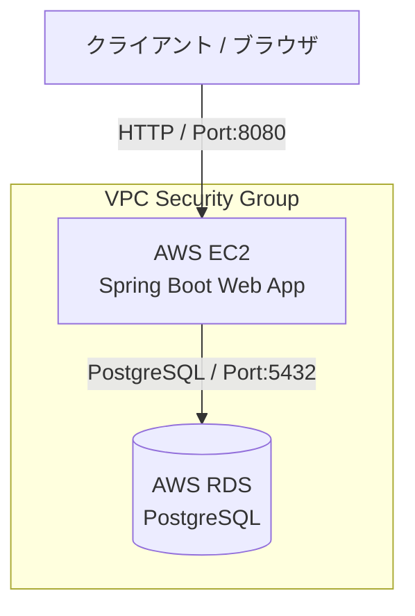
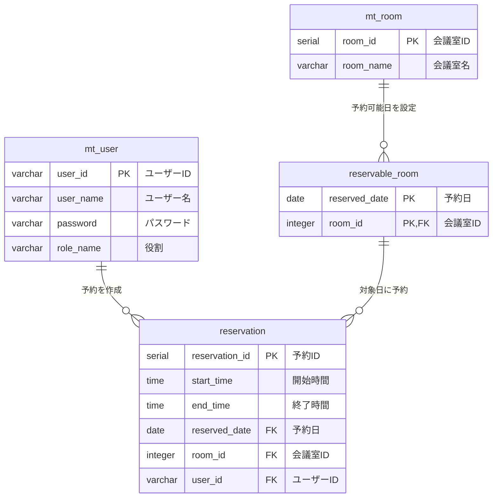

# MeetingRoomReservationDemo

Spring Boot と PostgreSQL で構築した会議室予約システムです。
AWS (EC2 / RDS) 上にデプロイし、動作確認を完了しています。（※現在はコスト抑制のためAWS環境を停止中）

## 動作デモ

(https://github.com/user-attachments/assets/3d116d11-4749-4e4a-8558-3e617a4e9ad3)" />

## 主な機能・バリデーション制御
- **ユーザー認証・認可:** Spring Securityによるログイン制御（一般ユーザー / 管理者権限）
- **会議室一覧・予約機能:** 日付ごとの空き状況確認、新規予約登録
- **入力チェック（バリデーション機能）:**
  - **過去日制御:** 過去の日付は選択不可
  - **時間整合性チェック:** 予約の「開始時間」が「終了時間」より後になっている場合はエラー表示
  - **重複予約防止:** 同一会議室で既存の予約時間帯と重なる申請はエラー表示し、DBの整合性を保護

## 使用技術
- **言語 / FW:** Java 21, Spring Boot 3.1.1, Spring Security, Thymeleaf
- **データベース:** PostgreSQL (RDS)
- **インフラ / クラウド:** AWS (EC2, RDS)
- **ビルドツール:** Maven

## システム構成図 (AWS)

## データベース設計 (ER図)

## インフラ・開発の工夫
- セキュリティ構成: EC2（アプリ層）とRDS（DB層）を分離し、RDSへはEC2からのセキュリティグループ経由のみアクセスを許可する安全なネットワーク構成を構築。
- データ保護: アプリケーション側での時間重複チェックおよびDB制御により、不正なデータの登録を未然に防ぐ設計。
